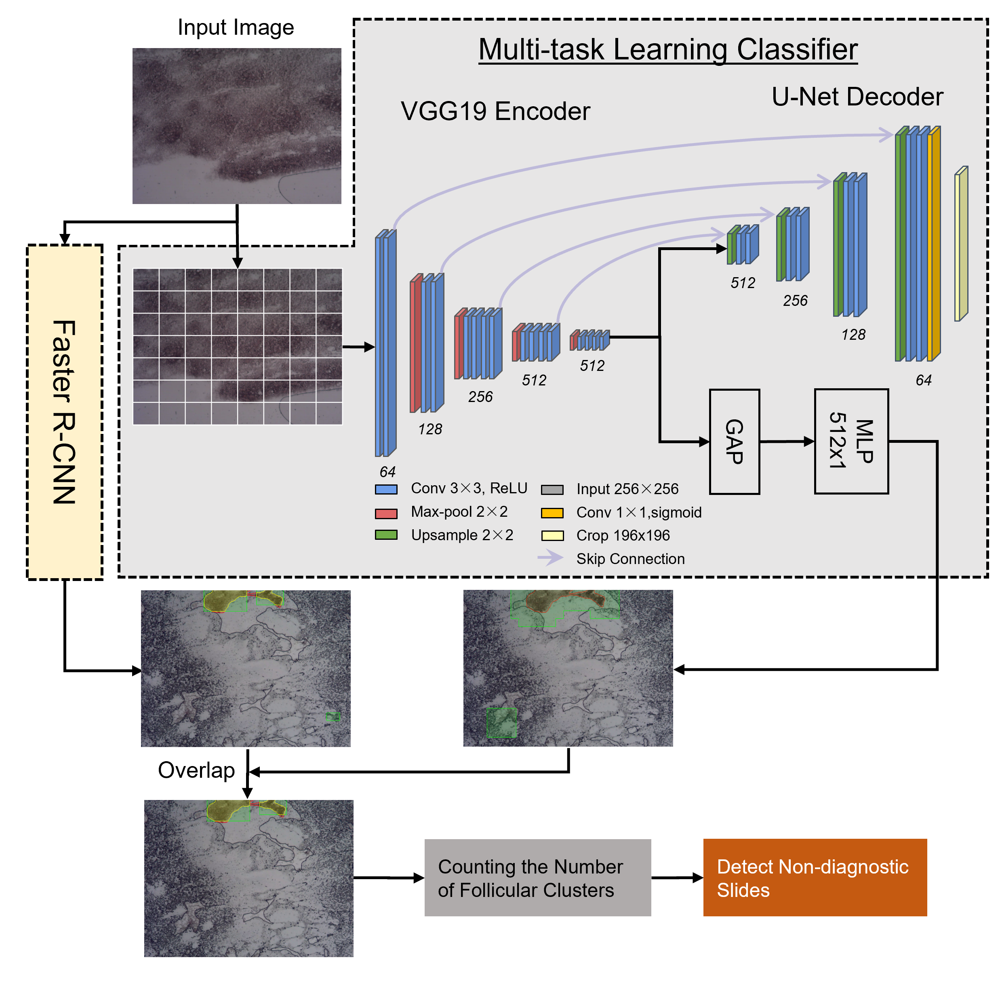

# Fine-Needle-Aspiration screening pipeline (FNA-Net)
 

**Screening Adequacy of Unstained Fine Needle Aspiration Samples
Using a Deep Learning-based Classifier**  
by Junbong Jang, Young Kim, Brian Westgate, Yang Zong, Caleb Hallinan, Ali Akalin, Kwonmoo Lee

  

  

This project is in collaboration with UMass Medical Center to automatically detect follicular clusters 
in the FNA thyroid biopsy samples smeared on unstained slides 
and classify the adequacy of the unstained slides for further diagnosis.  
<!-- To learn more about our pipeline (FNA-Net), please read our [paper]( ) -->

This repository includes the codes for running our Slide Scanner and FNA-Net.
Codes for MARS-Net and Faster R-CNN can be obtained from different repositories.

# Software Requirements
* Works in Ubuntu v16.04, v18.04, Windows 10, and Mac OS.
* Python v3.8
* Tensorflow v2.2 & CUDA v10.1 or Tensorflow v2.4 & CUDA v11.3

# Installation
* Download this repository 
* Install Python v3.8 and Python packages listed in requirements.txt
#### (instructions for Windows 10)
* Go to https://www.lfd.uci.edu/~gohlke/pythonlibs/
* Download 
  * Fiona-1.8.19-cp38-cp38-win_amd64
  * GDAL-3.2.3-cp38-cp38-win_amd64
  * rasterio-1.2.3-cp38-cp38-win_amd64
* Install them in the following order
  * pip install Fiona-1.8.19-cp38-cp38-win_amd64
  * pip install GDAL-3.2.3-cp38-cp38-win_amd64
  * pip install rasterio-1.2.3-cp38-cp38-win_amd64
 
# Slide Scanner
Please note that the user need our Slide Scanner to perform this step.
Alternatively, the user can build custom slide scanner and use our code to run the scanner.
* Connect USB to Arduino mounted in our Slide Scanner
* Run machine_control/PhotoCapture.py
Then, the slide scanner will automatically move the slide and take photos of the entire slide within a few minutes
 
# Dataset
We assume that the user has the dataset comprised of images and their masks indicating 
the pixel-wise location of the follicular clusters.
* Move the dataset into the assets folder
  * store image files in the images folder
  * store mask files in the masks folder
* Randomly split the dataset into training, validation and test set by running
  * data_processing/train_test_split.py
* Convert mask labels to ground truth boxes by running data_processing/mask_to_box_labels.py
  * Store the generated numpy file in the generated folder
  * Our ground truth boxes are stored in generated/ground_truth_boxes.npy

# Training and Evaluation of the patch-wise classifier,
* Download MARS-Net from the Github repository https://github.com/kleelab-bch/MARS-Net
* Follow the instructions in MARS-Net repository for installation and cropping. 
* Then, run the following Python scripts in order to train and evaluate the classifier
    * MARS-Net/models/train.py 
    * MARS-Net/models/predict.py 
    * MARS-Net/models/evaluate_classifier.py 
* Store the coordinates of the detected follicular boxes as the numpy file in the generated folder
  * Our detected follicular boxes are stored in generated/MTL_auto_reg_aut_boxes.npy

# Training of the Faster R-CNN,
For detailed explanation on training the object detection model, please refer to documents for Tensorflow Object Detection API at https://github.com/tensorflow/models/tree/master/research/object_detection
* Download "Faster R-CNN Inception ResNet V2 640x640" from https://github.com/tensorflow/models/blob/master/research/object_detection/g3doc/tf2_detection_zoo.md
* In its pipeline.config file, change "fine_tune_checkpoint", "label_map_path", "input_path" based on user's path and set num_classes to 2
* Convert image and mask dataset into the tfrecord format
* Train the model to detect two classes by using assets/label.pbtxt
* Detect follicular clusters on the test set images
* Store the coordinates of the detected follicular boxes as the numpy file in the generated folder
  * Our detected follicular boxes are stored in generated/faster_640_boxes.npy

# Evaluation of the FNA-Net
This section calculates the area overlap between the ground truth mask and the prediction boxes and
visualizes follicular cluster detection results per image. 
Also, it performs the hierarchical bootstrapping and visualizes its summary statistics and precision-recall curves of models.

* In the command prompt or terminal based on the user's operating systems, run  
  * evaluation/run_eval.py
  * Then, the results will be generated in the evaluation/generated folder
